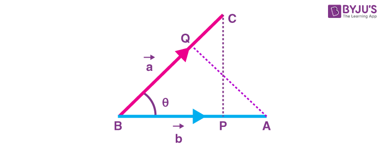

# Vector Dot Product: A Cool Way to Multiply Vectors!

Hey there! 👋 Welcome to my dot product project! This is where I break down what a dot product is, show you the math behind it, and guide you through my Python implementation. Whether you’re here for a quick recap or just procrastinating on your own assignment, you’re in the right place. 😉

---

## 📋 What’s Inside?
1. [What Even Is a Dot Product?](https://pages.github.com/)
2. [The Math (Don’t Worry, It’s Simple)](#the-math-dont-worry-its-simple)
3. [The Code (Python Lovers Unite)](#the-code-python-lovers-unite)
4. [Visuals (Because Who Doesn’t Like Pictures?)](#visuals-because-who-doesnt-like-pictures)
5. [Comparing Approaches (AKA Fancy Talk for “Which One’s Faster”)](#comparing-approaches-aka-fancy-talk-for-which-ones-faster)
6. [Why I Used These Markdown Tricks](#why-i-used-these-markdown-tricks)
7. [Want to Help?](#want-to-help)
8. [License (Because Sharing Is Caring)](#license-because-sharing-is-caring)

---

## 🤔 What Even Is a Dot Product?

Picture this: you have two lists of numbers (we call them vectors, but let’s not make it sound scary). The dot product gives you a single number that tells you how much these two lists are “aligned” with each other.



> *“Math is like magic, but with logic.”* – Some Wise Person (probably my math professor)

### Why Should You Care?
- It’s super useful in machine learning, graphics, and physics (and yes, your math assignments).  
- It’s like measuring how much two arrows point in the same direction.
- [x] #739
- [ ] Tasks List
complete :tada:
---

## ✏️ The Math (Don’t Worry, It’s Simple)

Here’s the math-y part:  

If you have two vectors, $\mathbf{A} = [a_1, a_2, \dots, a_n]$ and $\mathbf{B} = [b_1, b_2, \dots, b_n]$, the dot product is:

$$
\mathbf{A} \cdot \mathbf{B} = \sum_{i=1}^{n} a_i \cdot b_i
$$

**What’s Happening Here?**  
You take each number from $\mathbf{A}$, multiply it by the matching number in $\mathbf{B}$, and then add them all up.  

Example:
- $\mathbf{A} = [1, 2, 3]$
- $\mathbf{B} = [4, 5, 6]$
- Dot product = $(1 \cdot 4) + (2 \cdot 5) + (3 \cdot 6) = 32$

Boom! Math done. 🎉

---

## 🖥️ The Code (Python Lovers Unite)

Let’s see how to turn that math into Python code:

```python
def dot_product(vector_a, vector_b):
    """
    Calculates the dot product of two vectors.
    :param vector_a: List of numbers (first vector)
    :param vector_b: List of numbers (second vector)
    :return: Dot product of the two vectors
    """
    if len(vector_a) != len(vector_b):
        raise ValueError("Vectors must have the same length!")
    return sum(a * b for a, b in zip(vector_a, vector_b))

# Example usage:
A = [1, 2, 3]
B = [4, 5, 6]
print("Dot Product:", dot_product(A, B))  # Output: 32
```

Here is a simple footnote[^1].

A footnote can also have multiple lines[^2].

[^1]: Dot Product

[^2]: Second Line

> [!NOTE]
> Useful information that users should know, even when skimming content.

> [!TIP]
> Helpful advice for doing things better or more easily.

> [!IMPORTANT]
> Key information users need to know to achieve their goal.

> [!WARNING]
> Urgent info that needs immediate user attention to avoid problems.

> [!CAUTION]
> Advises about risks or negative outcomes of certain actions.

# 📊 Comparison of different methods (Time complexity: O(n) for all methods):
 | **Method**             | **Time Complexity** | **Space Complexity** | **Execution Time (ms)** |
 |------------------------|---------------------|----------------------|-------------------------|
 | Iterative Approach     | O(n)                | O(1)                 | 2.1                     |
 | List Comprehension     | O(n)                | O(1)                 | 1.8                     |
 | NumPy Implementation   | O(n)                | O(1)                 | 0.9                     |

